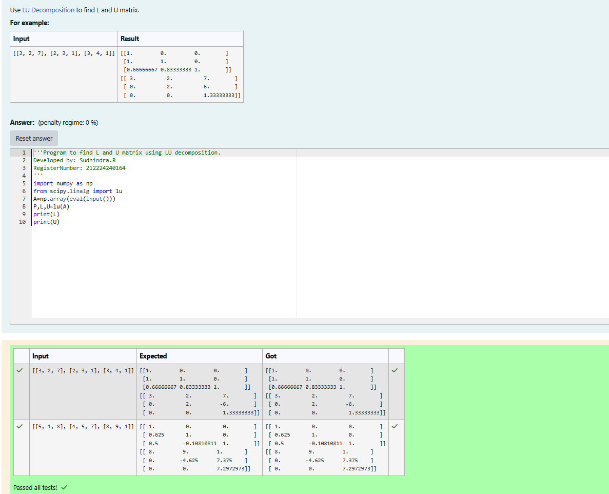
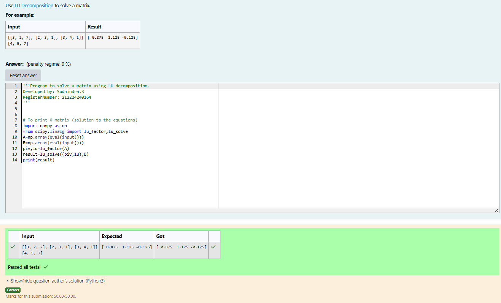

# LU Decomposition 

## AIM:
To write a program to find the LU Decomposition of a matrix.

## Equipments Required:
1. Hardware – PCs
2. Anaconda – Python 3.7 Installation / Moodle-Code Runner

## Algorithm
## (1) To Find The L and u matrix
    1.Import NumPy and lu from scipy.linalg.

    2.Read matrix input from the user using input() and convert it into a NumPy array.

    3.Perform LU decomposition using lu() function and store the result in P, L, U.

    4.Print the lower triangular matrix L.

    5.Print the upper triangular matrix U.

## (2) To Find The L and u matrix

    1.Import NumPy and the functions lu_factor and lu_solve from scipy.linalg.

    2.Read matrix A (coefficient matrix) from the user and convert it into a NumPy array.

    3.Read matrix or vector B (right-hand side of the equation Ax = B) from the user and convert it into a NumPy array.

    4.Perform LU factorization of matrix A using lu_factor(A).This returns lu (combined LU decomposition) and piv (pivot indices).

    5.Solve the linear system using lu_solve((piv, lu), B) and store the result.

    6.Print the solution vector or matrix.

## Program:
(i) To find the L and U matrix
```
Program to find L and U matrix using LU decomposition.
Developed by: Sudhindra.R
RegisterNumber: 212224240164


import numpy as np
from scipy.linalg import lu
A=np.array(eval(input()))
P,L,U=lu(A)
print(L)
print(U)
```
(ii) To find the LU Decomposition of a matrix
```
Program to solve a matrix using LU decomposition.
Developed by: Sudhindra.R
RegisterNumber: 212224240164


# To print X matrix (solution to the equations)
import numpy as np
from scipy.linalg import lu_factor,lu_solve
A=np.array(eval(input()))
B=np.array(eval(input()))
piv,lu=lu_factor(A)
result=lu_solve((piv,lu),B)
print(result)
```

## Output:



## Result:
Thus the program to find the LU Decomposition of a matrix is written and verified using python programming.

